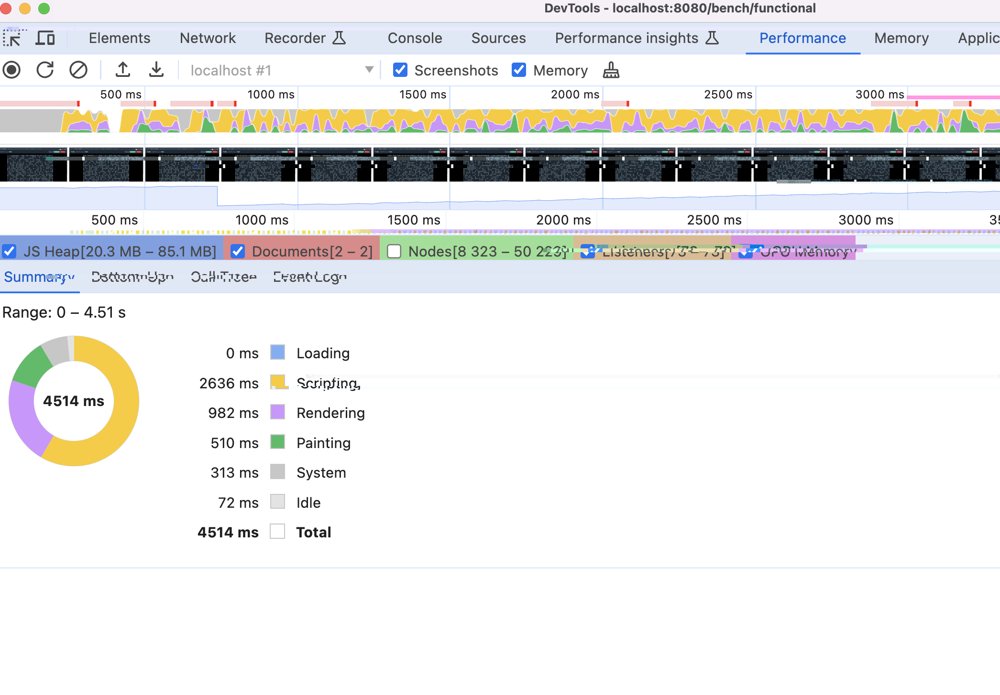
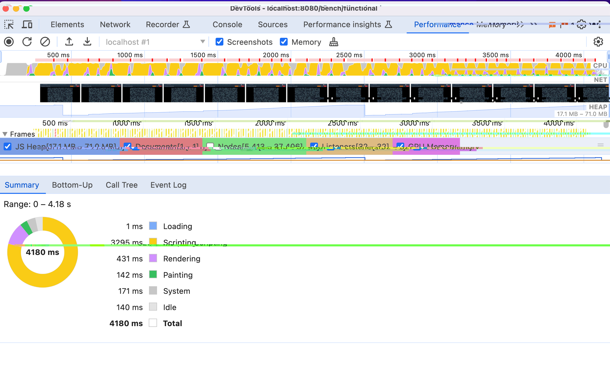
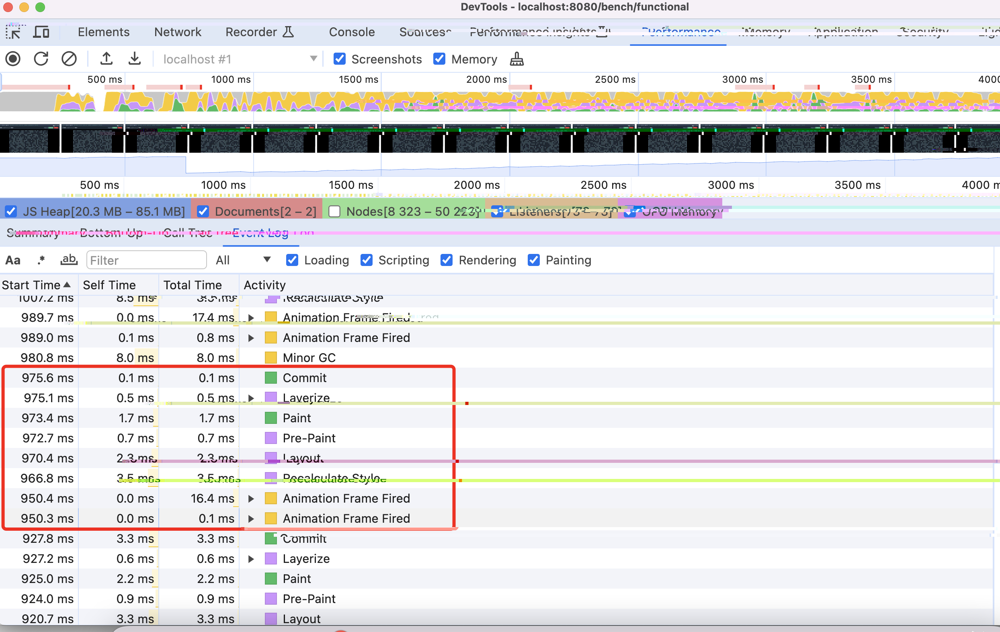
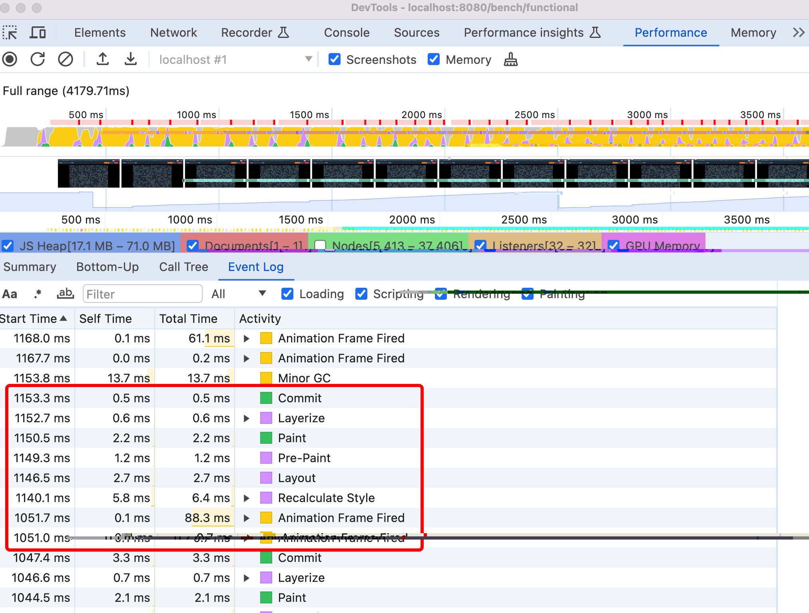
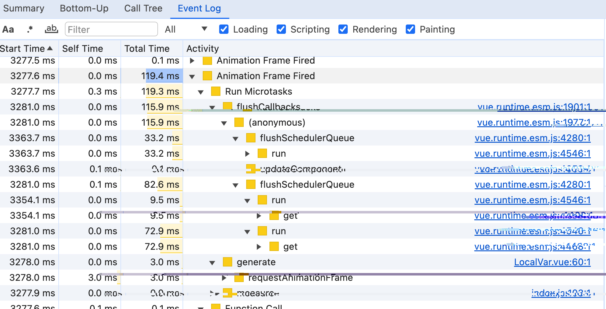
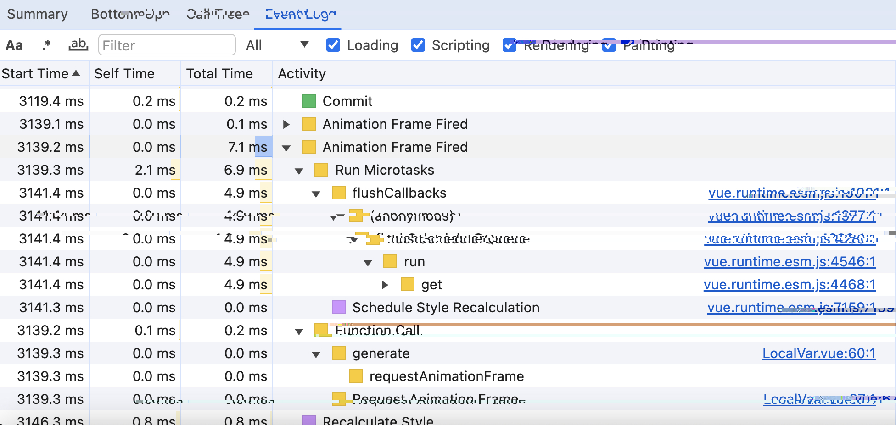
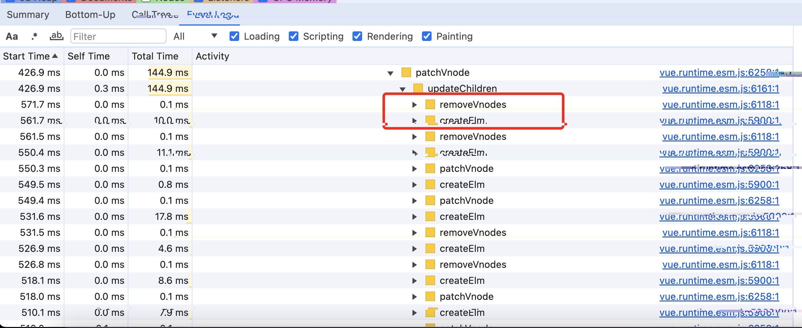
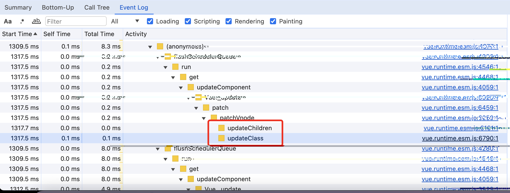
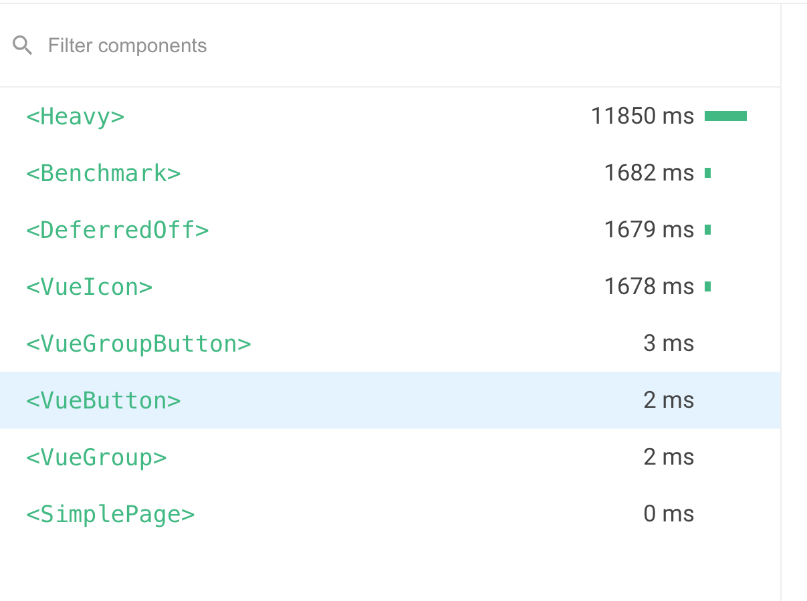
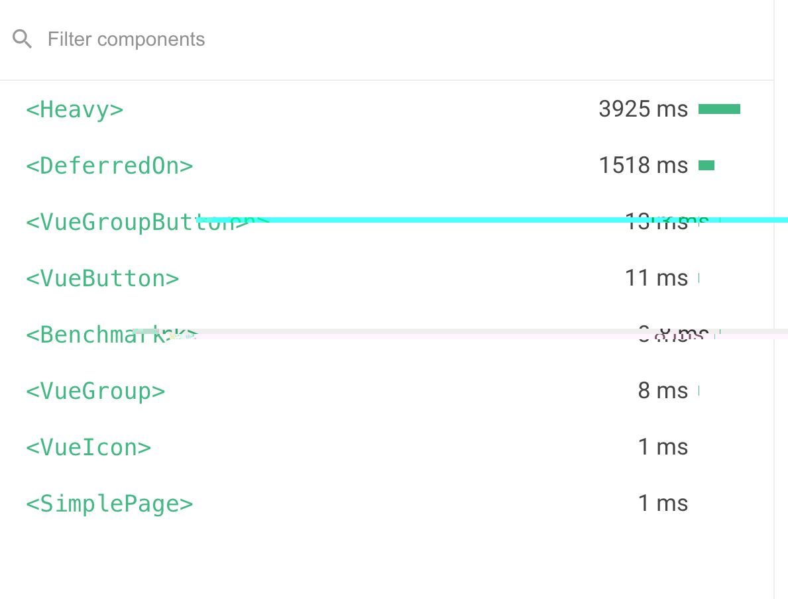

# 资料

[揭秘 Vue.js 九个性能优化技巧](https://juejin.cn/post/6922641008106668045) - 黄轶

示例网址： https://vue-9-perf-secrets.netlify.app/bench/deferred

[Akryum/vue-9-perf-secrets 代码地址](https://github.com/Akryum/vue-9-perf-secrets)

使用`fps-indicator`库来获取页面的 fps

# 性能指标

## 资料文章

1. [如何做一次前端性能优化](https://mp.weixin.qq.com/s/cGL8zd3TmhbsgSF7tjKnew) - 王圣松

该文章主要分析了一款甘特图插件，在使用时卡顿的问题。通过分析找到原因，解决问题。记录下列知识点：

涉及到绘画相关的动画操作，要 60fps 才能够到顺滑的阶段。30fps 勉强卡顿，20fps 就卡顿拖影严重了。

而根据一般的显示器刷新率（60hz）和目前的浏览器所支持的最高刷新率来算，平均下来每一帧的任务时长一般只有 16.6ms。当单帧任务时长超过 16.6ms 时，就会产生卡顿和掉帧。

longtask（Chrome 官方对 longtask 的定义是大于 50ms，即 20fps）。

分析问题的过程和思路，在 perfommance 面板上找到对应执行时间长的方法，分析为什么时间长，做相应优化

# Functional components

无状态 (没有 data) 和无实例 (没有 this 上下文)的组件，使用函数式组件。

## 示例

对比使用函数式组件和普通组件的 performance，这里说明了一下如何看 summary 数据证明性能提升。

函数式组件：


普通组件：


| 单位 ms   | 说明                        | 普通组件 | 函数式组件 |
| --------- | --------------------------- | -------- | ---------- |
| total     | 白色 总录制时间             | 4180     | 4514       |
| scripting | 黄色 重新绘制前脚本执行计算 | 3295     | 2636       |
| rendering | 紫色                        | 431      | 982        |
| painting  | 绿色                        | 142      | 510        |
| system    | 深灰色                      | 171      | 313        |
| idle      | 浅灰色 空闲时间             | 140      | 72         |

都是记录四秒，看 Event Log 里主要的循环过程：

Animation Frame Fired => Animation Frame Fired => recalculate style => layout => pre-paint => paint => layerize => commit

- 穿插着有 minor GC 垃圾回收
- Animation Frame Fired 接连有两次应该是代码写的原因

在 Event Log 中间选择差不多的时间段，计算一次循环时间，从 Animation Frame Fired 开始到 commit 结束。

函数式组件约 25.3ms、32.4ms：


普通组件的 130ms、102.3ms：


结合渲染 pipeline 知识，这应该可以估算为渲染一张图片所需要的时间。

其中占比最高的就是 Animation Frame Fired 的时间（16.4ms vs 88.3ms），点开三角箭头可以看到主要是 vue 里的 flushCallbacks 方法执行时间导致的差异。相比函数式组件，vue 对普通组件多了很多处理。

都是在大约 4s 的时间里，函数式组件中渲染一张图片用的时间更短，因此同样的时间可以渲染更多张图片。时间更接近于 16.7ms，更不会掉帧和卡顿，用户的感知就会更好。

总时间大致相同（performance 中手动点按钮记录的，不会非常精确），函数式组件执行 flushCallbacks 的时间更少（会被记入 scripting），总的 scripting 时间更少，rendering 占据的时间自然更多。实际是渲染了更多张图片，用户体验更好也就是性能更好了。

在 patch 的过程中，如果遇到一个节点是组件 vnode，会递归执行子组件的初始化过程。而函数式组件无状态 (没有 data) 和无实例 (没有 this 上下文)，用一个简单的 render 函数返回 vnode，因此渲染开销低很多。

# Child component splitting

Vue 的更新是组件粒度的。对于渲染开销大的部分，恰当的做子组件拆分。

## 示例

优化前：

```vue
<template>
  <div :style="{ opacity: number / 300 }">
    <div>{{ heavy() }}</div>
  </div>
</template>

<script>
export default {
  props: ["number"],
  methods: {
    heavy() {
      const n = 100000;
      let result = 0;
      for (let i = 0; i < n; i++) {
        result += Math.sqrt(Math.cos(Math.sin(42)));
      }
      return result;
    },
  },
};
</script>
```

优化后：

```vue
<template>
  <div :style="{ opacity: number / 300 }">
    <ChildComp />
  </div>
</template>

<script>
export default {
  components: {
    ChildComp: {
      methods: {
        heavy() {
          const n = 100000;
          let result = 0;
          for (let i = 0; i < n; i++) {
            result += Math.sqrt(Math.cos(Math.sin(42)));
          }
          return result;
        },
      },
      render(h) {
        return h("div", this.heavy());
      },
    },
  },
  props: ["number"],
};
</script>
```

优化后的方式是把这个耗时任务 heavy 函数的执行逻辑用子组件 ChildComp 封装了，由于 **Vue 的更新是组件粒度**的，虽然每一帧都通过数据修改导致了父组件的重新渲染，但是 ChildComp 却不会重新渲染，因为它的内部也没有任何响应式数据的变化。

原作者 Akryum 的例子，意思是如果子组件渲染开销很大（heavy to render），拆分成子组件。vue 是足够聪明的，如果没必要的话，是不会重新渲染子组件的。

作者 huangyi 提出在这个例子中使用计算属性更好，得益于计算属性自身缓存特性，耗时的逻辑也只会在第一次渲染的时候执行，而且使用计算属性也没有额外渲染子组件的开销。

# Local variables

对于只需要在最开始做一次依赖收集的响应式变量，在后续使用过程中可以赋值给局部变量，避免多次读取响应式变量带来的开销。

## 示例

优化前的组件多次在计算过程中访问 `this.base`，而优化后的组件会在计算前先用局部变量 `base`，缓存 `this.base`，后面直接访问 `base`。

| 单位 ms   | 说明                        | this.base | 局部变量 base |
| --------- | --------------------------- | --------- | ------------- |
| total     | 白色 总录制时间             | 3451      | 3691          |
| scripting | 黄色 重新绘制前脚本执行计算 | 3151      | 1087          |
| rendering | 紫色                        | 146       | 840           |
| painting  | 绿色                        | 36        | 210           |
| system    | 深灰色                      | 58        | 221           |
| idle      | 浅灰色 空闲时间             | 60        | 1332          |





优化后代码：

```vue
<template>
  <div :style="{ opacity: start / 300 }">{{ result }}</div>
</template>

<script>
export default {
  props: ["start"],
  computed: {
    base() {
      return 42;
    },
    result({ base, start }) {
      // 计算属性这里拿到this上的值
      // 源码中 Watcher.prototype.get函数中 value = this.getter.call(vm, vm)
      let result = start;
      for (let i = 0; i < 1000; i++) {
        result +=
          Math.sqrt(Math.cos(Math.sin(base))) +
          base * base +
          base +
          base * 2 +
          base * 3;
      }
      return result;
    },
  },
};
</script>
```

看 Event Log 的执行时间和具体执行的代码对比，读取 `this.base`会多很多操作。`this.base` 是一个响应式对象，所以会触发它的 getter，进而会执行依赖收集相关逻辑代码。

从需求上来说，`this.base` 执行一次依赖收集就够了，把它的 getter 求值结果返回给局部变量 base，后续再次访问 base 的时候就不会触发 getter，也不会走依赖收集的逻辑了。

# Reuse DOM with v-show

需要复用 DOM 的情况下使用 v-show，而不是 v-if。

## 示例

| 单位 ms   | 说明                        | v-if | v-show |
| --------- | --------------------------- | ---- | ------ |
| total     | 白色 总录制时间             | 3575 | 3579   |
| scripting | 黄色 重新绘制前脚本执行计算 | 3174 | 816    |
| rendering | 紫色                        | 203  | 1012   |
| painting  | 绿色                        | 71   | 346    |
| system    | 深灰色                      | 112  | 397    |
| idle      | 浅灰色 空闲时间             | 15   | 1008   |

对于 v-if 渲染的节点，由于新旧节点 vnode 不一致，在核心 diff 算法比对过程中，会移除旧的 vnode 节点，创建新的 vnode 节点。那么就会创建新的 Heavy 组件，又会经历 Heavy 组件自身初始化、渲染 vnode、patch 等过程。



对于 v-show 渲染的节点，由于新旧 vnode 一致，它们只需要一直 patchVnode 即可。在 patchVnode 过程中，内部会对执行 v-show 指令对应的钩子函数 update，然后它会根据 v-show 指令绑定的值来设置它作用的 DOM 元素的 style.display 的值控制显隐。



但是 v-show 相比于 v-if 的性能优势是在组件的更新阶段，如果仅仅是在初始化阶段，v-if 性能还要高于 v-show，原因是在于它仅仅会渲染一个分支，而 v-show 把两个分支都渲染了。

# KeepAlive

`<keep-alive>` 包裹动态组件时，会缓存不活动的组件实例，而不是销毁它们。

在使用 KeepAlive 后，被 KeepAlive 包裹的组件在经过第一次渲染后的 vnode 以及 DOM 都会被缓存起来，然后在下一次再次渲染该组件的时候，直接从缓存中拿到对应的 vnode 和 DOM，然后渲染，并不需要再走一次组件初始化，render 和 patch 等一系列流程。

空间换时间。

# Deferred features

把一个组件的一次渲染拆分成多次渲染，如果有渲染耗时的组件，可以考虑使用。

可以看到优化后的效果是一次展示一部分。

优化前：



优化后：


## 示例

Defer 的主要思想就是把一个组件的一次渲染拆成多次，它内部维护了 displayPriority 变量，然后在通过 requestAnimationFrame 在每一帧渲染的时候自增，最多加到 count。然后使用 Defer mixin 的组件内部就可以通过 v-if="defer(xxx)" 的方式来控制在 displayPriority 增加到 xxx 的时候渲染某些区块了。

## 异步加载和延迟加载

异步加载的异步体现在当组件渲染的时候，才去网络中加载组件对应的 JS，加载完了才渲染出来，这个异步是可控的，比如满足某种条件再去加载，首屏不一定加载。异步组件是组件资源的按需加载，针对的是网络加载问题。

而 Deferred features 是把一个渲染过重的组件拆成几个时间片去渲染，它可以控制某一块延时渲染出来，但最终都会渲染，也没有异步加载组件 JS 的逻辑。

这里都是讲的基本都是怎么提高使用时的用户体验，比如避免短时间的高度计算导致页面卡顿，基本上就是把单个大任务拆分成多个小任务，空间换时间这类。
要是抽象看的话，这两个可以认为是一个类型的问题：单个大任务拆分成多个小任务。

- 在 io 层就是 io 流拆分，避免其他 io 堵死
- 在 js 层就是 task 拆分，避免其他 task 堵死

# Time slicing

使用时间分片优化后总的时间还会更长一些，但是不会有明细的卡顿感，体验更好。

待看源码实现：src/components/benchmarks/fetch-items

> 这里要注意的一点，虽然我们拆时间片使用了 requestAnimationFrame API，但是使用 requestAnimationFrame 本身是不能保证满帧运行的，requestAnimationFrame 保证的是在浏览器每一次重绘后会执行对应传入的回调函数，想要保证满帧，只能让 JS 在一个 Tick 内的运行时间不超过 17ms。

# Non-reactive data

对于只是想在组件内部共享数据，并不需要响应式的数据，可以不放在 data 中，而仅仅是挂载到 this 上。

用 Object.freeze() 来优化性能也是类似的思路。

```js
export default {
  created() {
    // 在created里把数据放到this上
    this.scroll = null;
  },
  mounted() {
    this.scroll = new BScroll(this.$el);
  },
};
```

# Virtual scrolling

监听滚动事件，动态更新需要显示的 DOM 元素，计算出在视图中的位移。

由于在滚动的过程中实时去计算，会有一定的 script 执行的成本。因此在列表数据量不是很大的情况下，普通滚动就可以了。

[vue-virtual-scroller](https://github.com/Akryum/vue-virtual-scroller)

# 其他方式

懒加载图片、懒加载组件、异步组件

# 总结

性能优化的步骤：

1. 优化前，分析性能瓶颈，即哪里出现问题，导致性能不好
2. 采集优化前的数据
3. 针对原因进行优化操作
4. 采集优化后的数据进行对比
5. 总结

以上优化思路包括：

- 减少渲染次数，比如组件分割，使用 v-show，组件的 keep-alive
- 减少函数运行次数，比如 computed
- 减少查询变量的次数，比如本地变量、不使用 data 中的响应式数据。
- 切割组件或者组件逐渐渲染和加载，避免大粒度行为导致卡死的观感。像延时加载不可见的区域、数组分割、虚拟列表。

Demo 的很多的场景都是高帧数动画。这里的优化和首屏渲染无关。

性能优化的最终目的是为了提升用户体验。此时就有两种思路，一种是优化本身运行速度；一种是优化程序响应，让用户感觉上变快。

上述一部分技巧不一定对运行速度有帮助，比如时间切片、延迟渲染，但是却使得渲染计算任务的分配更为合理，运行过程始终保持较高的 FPS，用户在使用过程中不感觉卡顿。

工具：[Vue Devtools](https://devtools.vuejs.org/) ，Vue 官方 Chrome 插件，有性能检测选项，能更直观看到每秒帧数和不同组件渲染耗时。
