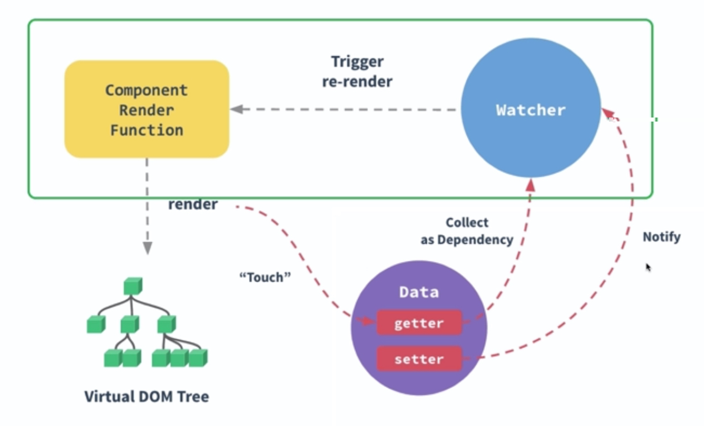

当模板依赖于多个变量时，每个变量变化都会触发一次更新

- 基于上一篇文章[Vue 响应式原理](https://segmentfault.com/a/1190000023139579)，在如下代码中，模板 tpl 依赖于 x、y、z 三个变量，其中一个变化就会触发变化，因此会输出三次。

```js
let active;
let watch = (cb) => {
  active = cb;
  active();
  active = null; // 避免重复收集
};
class Dep {
  // Set 数据结构 类似于数组，但成员都是唯一的
  // 通过new生成Set数据结构
  constructor() {
    this.deps = new Set();
  }
  depend() {
    // 依赖收集
    if (active) {
      // 通过add()方法向Set结构加入成员
      this.deps.add(active);
    }
  }
  notify() {
    // 触发
    this.deps.forEach((dep) => dep());
  }
}
let ref = (initValue) => {
  let value = initValue;
  let dep = new Dep();
  return Object.defineProperty({}, "value", {
    get() {
      dep.depend();
      return value;
    },
    set(newValue) {
      value = newValue;
      dep.notify();
    },
  });
};
let x = ref(1);
let y = ref(2);
let z = ref(3);
watch(() => {
  let tpl = `hello ${x.value} ${y.value} ${z.value} <br/>`;
  document.write(tpl);
});

x.value = 2;
y.value = 2;
z.value = 2;

/*
输出
hello 1 2 3
hello 2 2 3
hello 2 2 3
hello 2 2 2
修改三次，输出三次
 */
```

如何优化？

- 在一个函数块中包含对多个变量的依赖时，可以将这些依赖放到一个队列中。当函数块执行完毕后，再进行一次批量的渲染操作。
- 微任务会在宏任务执行完成后立即执行，所以可以将最后的操作放到一个微任务中，这里用 Promise.resolve().then()实现

```js
let active;
let watch = (cb) => {
  active = cb;
  active();
  active = null; // 避免重复收集
};

// 队列，用来存放任务
let queue = [];
// 异步操作，会在同步操作执行后执行
let nextTick = (cb) => Promise.resolve().then(cb);

// 往队列里添加任务
let queueJob = (job) => {
  if (!queue.includes(job)) {
    queue.push(job);
    // 添加之后，将执行放到异步任务中
    nextTick(flushJobs);
  }
};
// 执行任务
let flushJobs = () => {
  let job;
  while (queue.length > 0) {
    job = queue.shift();
    job && job();
  }
};

class Dep {
  // Set 数据结构 类似于数组，但成员都是唯一的
  // 通过new生成Set数据结构
  constructor() {
    this.deps = new Set();
  }
  depend() {
    // 依赖收集
    if (active) {
      // 通过add()方法向Set结构加入成员
      this.deps.add(active);
    }
  }
  notify() {
    // 触发
    // 先放到队列中
    this.deps.forEach((dep) => queueJob(dep));
  }
}
let ref = (initValue) => {
  let value = initValue;
  let dep = new Dep();
  return Object.defineProperty({}, "value", {
    get() {
      dep.depend();
      return value;
    },
    set(newValue) {
      value = newValue;
      dep.notify();
    },
  });
};
let x = ref(1);
let y = ref(2);
let z = ref(3);
watch(() => {
  let tpl = `hello ${x.value} ${y.value} ${z.value}<br/>`;
  document.write(tpl);
});

x.value = 2;
y.value = 2;
z.value = 2;

/*
输出
hello 1 2 3
hello 2 2 2
三次赋值，进入队列中的函数只有一个，所以最后只会执行一次
 */
```

静态方法：[Vue.nextTick\(\[callback, context\]\)](https://cn.vuejs.org/v2/api/?#Vue-nextTick)
实例方法：[vm.$nextTick\(\[callback\]\)](https://cn.vuejs.org/v2/api/?#vm-nextTick) this 为 Vue 实例

- 在下次 DOM 更新循环结束之后执行延迟回调
- 通常用于在修改数据之后使用，在回调中获取更新后的 DOM
  ```js
  mounted () {
      this.$nextTick(() => {
          // 这里代码将在当前组件和所以子组件挂载完毕后执行
      })
  }
  ```
