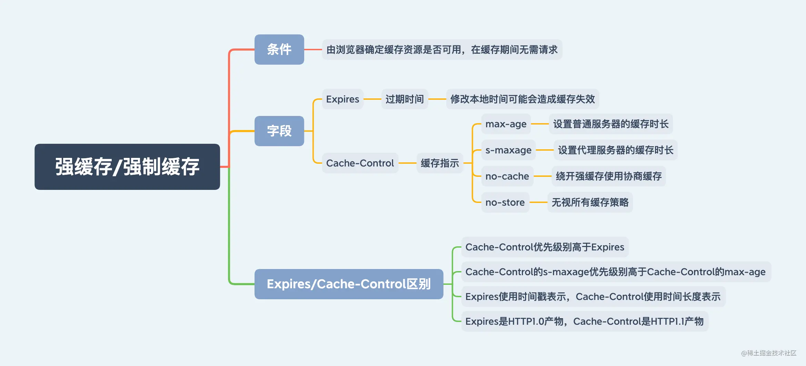

# 说明

掘金小册《从 0 到 1 落地前端工程化》学习笔记

第 2-11 章

# 第 2 章 模块化

资料：[深入浅出 Commonjs 和 Es Module](https://juejin.cn/post/6994224541312483336)

## ESM 和 CJS 区别

| -            | **CJS** Node 环境                                   | **ESM** 浏览器环境                      |
| ------------ | --------------------------------------------------- | --------------------------------------- |
| **语法类型** | 动态                                                | 静态                                    |
| **关键声明** | `require`、`module.exports`、`exports`              | `export`与`import`                      |
| **加载方式** | 运行时加载                                          | 编译时加载                              |
| **加载行为** | 同步加载                                            | 异步加载                                |
| **书写位置** | 任何位置                                            | 顶层位置                                |
| **指针指向** | `this`指向`当前模块`                                | `this`指向`undefined`                   |
| **执行顺序** | 首次引用时`加载模块` 再次引用时`读取缓存`           | 编译时生成`只读引用` 执行时才是正式取值 |
| **属性引用** | 基本类型属于`复制不共享` 引用类型属于`浅拷贝且共享` | 所有类型属于`动态只读引用`              |

### CommonJS

#### require

require 本质上就是一个函数，那么函数可以在任意上下文中执行。所以 require 可以在任意的上下文，动态加载模块。

所以说语法类型是动态？

```js
// a.js
console.log("我是 a 文件");
exports.say = function () {
  // require可以写在{}里
  const getMes = require("./b");
  const message = getMes();
  console.log(message);
};
// main.js
const a = require("./a");
a.say();
```

#### 首次引用时`加载模块` 再次引用时`读取缓存`

module ：在 Node 中每一个 js 文件都是一个 module ，module 上保存了 exports 等信息之外，还有一个 loaded 表示该模块是否被加载。true 表示已经加载，false 表示还没有加载

Module ：以 nodejs 为例，整个系统运行之后，会用 Module 缓存每一个模块加载的信息。

一次 require 大致流程是这样的：

require 会接收一个参数——文件标识符，然后分析定位文件。接下来会从 Module 上查找有没有缓存，如果有缓存，那么直接返回缓存的内容。

如果没有缓存，会创建一个 module 对象，缓存到 Module 上，然后执行文件，加载完文件，将 loaded 属性设置为 true ，然后返回 module.exports 对象。借此完成模块加载流程。

**先缓存后执行。**

#### 运行时加载

指整体加载模块生成一个对象，再从对象中获取所需的属性方法去加载。最大特性是全部加载，只有运行时才能得到该对象，无法在编译时做静态优化。

### ESModule

#### ESModule 的‘所有类型属于`动态只读引用`’

- 使用 import 导入的变量是只读的，可以理解默认为 const 装饰，无法被赋值
- 使用 import 导入的变量是与原变量绑定/引用的，可以理解为 import 导入的变量无论是否为基本类型都是引用传递。

例：对于 a 模块导出的 number 类型 num 变量，在 b 模块中引用后，不能直接对 num 进行操作，只能调用 a 模块中定义的方法对 num 进行操作

#### import()动态引入

import() 可以动态使用，加载模块。可以放在条件语句或者函数执行上下文中；可以用于实现懒加载。

import() 返回一个 Promise 对象， 返回的 Promise 的 then 成功回调中，可以获取模块导出的信息。

其中 default 代表 export default ，`__esModule` 为 es module 的标识。

#### 编译时加载

指直接从模块中获取所需的属性方法去加载。最大特性是按需加载，在编译时就完成模块加载，效率比其他方案高，无法引用模块本身(本身不是对象)，但可拓展 JS 高级语法(宏与类型校验)。

### 加载方式差异

- javascript 是一门 JIT（即时编译） 语言，v8 引擎拿到 js 代码后会边编译边执行，**在编译的时候 v8 就给 import 导入的模块建立静态的引用，并且在运行时不能更改**。所以 import 都放在文件开头，不能放在条件语句里。

- 即时编译（英语：Just-in-time compilation，缩写为 JIT；又译及时编译、实时编译），也称为动态翻译或运行时编译，是一种执行计算机代码的方法，这种方法设计在程序执行过程中（在执行期）而不是在执行之前进行编译。
  ​
- 而 require 导入模块是在运行时才对值进行拷贝，所以 require 的路径可以使用变量，并且 require 可以放在代码的任何位置。

- 基于这个差异，ESM 比 CJS 好做 tree-shaking。

举例：

a.js 和 b.js 里打印一句话

commonjs/main.js

```js
console.log("main.js开始执行");
const a = require("./a.js");
const b = require("./b.js");
console.log("main.js执行完毕");

// main.js开始执行
// 我是 a 文件
// 我是 b 文件
// main.js执行完毕
```

esmodule/main.js

```js
console.log("main.js开始执行");
import say from "./a.js";
import say1 from "./b.js";
console.log("main.js执行完毕");

// a模块加载
// b模块加载
// main.js开始执行
// main.js执行完毕
```

## 模块入口

- 通过 package.json 的 main 字段定义 CJS 的入口文件，module 字段定义 ESM 的入口文件。
- 例如，vue 源码中
  ```json
  {
    "main": "dist/vue.runtime.common.js",
    "module": "dist/vue.runtime.esm.js"
  }
  ```
- Node.js v12.16.0 给 package.json 增加了 exports 字段，允许在不同条件下匹配不同的路径。exports 的优先级比 main 和 module 高

## Node 环境中使用 ESM

- package.json 中将 type 设置为"module"表示使用 ESM 规范
- 低于 8.9.0 的 node 版本不支持使用 ESM，可以通过安装 babel 进行代码转换兼容

  - `npm i @babel/cli @babel/core @babel/node @babel/preset-env -D`
  - 配置

  ```json
  {
    "scripts": {
      "start": "babel-node src/index.js"
    },
    "babel": {
      "presets": ["@babel/preset-env"]
    }
  }
  ```

- v8.9.0+ 至低于 v13.2.0 版本 在命令中加上 --experimental-modules 即可支持 ESM
- v13.2.0+版本后不需要显式添加即可支持

```js
// 使用ESM方式写Node代码
import { readFileSync } from "fs";
import { dirname, join } from "path";
import { fileURLToPath } from "url";

const __filename = fileURLToPath(import.meta.url);
const __dirname = dirname(__filename);
console.log(__filename, __dirname);

const json = readFileSync(join(__dirname, "./info.json"));
const info = JSON.parse(json);
console.log(info);
```

# 第 3 章 格式化代码

- 使用 stylelint 和 eslint

## 提交代码前强制格式化

### husky

- husky 为 git 客户端增加 hook 的工具

  - pre-commit 钩子会在执行 git commit 时的触发，此时执行 lint 检查
  - 新版 husky 用法
  - npm install -D husky
  - package.json 中增加以下配置
    ```json
    {
      "scripts": {
        "prepare": "husky install"
      }
    }
    ```
    - 执行`husky install`或者`npm run prepare`，项目根目录下会生成.husky 文件夹
    - 添加 git hooks
      - 运行命令`npx husky add .husky/pre-commit "echo 'git commit trigger husky pre-commit hook' && npx lint-staged"`
      - .husky 文件夹下会生成 pre-commit 文件，`"echo 'git commit trigger husky pre-commit hook' && npx lint-staged"`会被写入该文件
      - 后续执行 git commit 操作前，pre-commit 钩子触发，打印内容，执行`npx lint-staged`。会根据 lint-staged 的配置，对暂存区的文件进行相应操作，比如 lint 格式化操作，保证所有提交的文件都经过了格式化

### lint-staged

- lint-staged 过滤出 git 代码暂存区文件（git add 过的文件）的工具

  - package.json

  ```json
  "lint-staged": {
     "src/**/*.{js,vue}": [
       "eslint --fix",
     ]
  },
  ```

# 第 4 章 规范提交代码

- 《Angular 提交规范》
- commitizen 基于模板驱动的约束规范工具
- cz-conventional-changelog 符合 《Angular 提交规范》的书写配置
- cz-customizable 自定义一份符合自己团队的提交规范
- commitlint 校验提交说明

## 局部部署

- `npm i -D commitizen cz-conventional-changelog`
- package.json 中增加

  ```json
  {
    "script": {
      "commit": "git add . && git-cz"
    },
    "config": {
      "commitizen": {
        "path": "node_modules/cz-conventional-changelog"
      }
    }
  }
  ```

- 执行`npm run commit`，按照要求在控制台交互中输入相关信息进行提交操作

# 第 5 章 云服务器

在腾讯云网站上，选购一个试用版的服务器，选择 linux 系统。就会得到一个已经安装好 linux 的实例（也就是服务器），设置一下密码。

打开 CMD，执行`ssh root@aaa.bbb.ccc.ddd`连接服务器（公网 IP），输入密码登录。

查看 linux 系统版本信息：`cat /proc/version`或者`uname -a`

# 第 6 章 域名系统

## DNS 如何解析域名

域名解析流程：

1. 浏览器缓存
2. 系统缓存（系统 Hosts 文件的 DNS 缓存）
3. 路由器缓存
4. 本地域名服务器
5. 根域名服务器
6. 顶级域名服务器
7. 保存结果到缓存

## 选购与部署域名系统

在腾讯云购买域名 csep.chat，完成备案，需要等待审核。

在腾讯云-我的域名列表中，选择操作列的<解析>添加一条解析记录（选择 A 记录），将域名解析为 IP 地址（就是前面购买的服务器公网 IP）。

记录类型有如下几种（未列举完全）：

- A 记录是最常用类型，将域名指向一个 IPv4 地址，如 8.8.8.8
- CNAME 将域名指向另一个域名地址，与其保持相同解析，如 https://www.dnspod.cn
- AAAA 将域名指向一个 IPv6 地址，如 ff06:0:0:0:0:0:0:c3
- NS 域名服务器记录，可将指定域名交由其他 DNS 服务商解析管理

通过实名认证后，需要等待一段时间后域名才能正常解析。可以打开[站长工具-DNS 查询](https://tool.chinaz.com/dns)，输入域名，看看能否解析成功。

备案和解析都成功后，nginx 配置中的`server_name 49.235.163.192;`改为`server_name csep.chat;`，通过 IP 访问就改为通过域名访问了。

# 第 7 章 站服务器

## nginx

### 安装 nginx

`yum install nginx` 通过 yum 安装 nginx

`nginx -v` 查看 nginx 版本

Nginx 配置文件存放在`/ect/nginx`目录中

`/etc/nginx/conf.d`目录用于存放用户自定义的子配置文件。

`/etc/nginx/nginx.conf`主配置文件会默认加载`conf.d`目录中的所有子配置文件

```txt
nginx.conf # 全局配置
├── events # 配置影响：Nginx服务器与用户的网络连接
├── http   # 配置功能：代理、缓存、日志等功能
│   ├── upstream # 配置后端地址：负载均衡不可或缺的部分
│   ├── server   # 配置虚拟主机：一个http块可包括多个server块
│   ├── server
│   │   ├── location # 一个server块可包括多个location块
│   │   ├── location # location块指令用于匹配URI
│   │   └── ...
│   └── ...
└── ...
```

### 操作 nginx

| 命令                 | 功能                                                           |
| -------------------- | -------------------------------------------------------------- |
| nginx                | 启动进程                                                       |
| nginx -t             | 验证配置                                                       |
| nginx -s reload      | 重启进程（修改配置后重启一下才会生效）                         |
| nginx -s stop        | 杀掉进程                                                       |
| ps -ef \| grep nginx | 查看进程信息（master process 主进程，worker process 工作进程） |

### nginx 应用

示例结构

```txt
/www # 存放示例代码的文件夹
├── client # 客户端代码
│		├── dist # vue项目build的代码，对应nginx配置文件 csep_chat.conf
├── server # 服务端代码
│   ├── upstream # 配置后端地址：负载均衡不可或缺的部分
├── static # 静态资源
│   ├── index.html # 默认展示的index.html
│   ├── image # 存放图片的文件夹
└── ...
```

csep_chat.conf 主域名`csep.chat`配置文件

csep_chat_static.conf 二级域名`static.csep.chat`配置文件

csep_chat_api.conf 二级域名`api.csep.chat`配置文件 端口 9999

#### 访问网站

在根目录中创建 www 文件夹，该文件夹中再创建两个文件夹，分别是 client 与 server。client 用于存放 Web 应用源码，server 用于存放 Node 应用源码。

准备好 vue 项目的 dist 文件夹放入`/www/client`

在`/etc/nginx/conf.d`目录中创建 csep_chat.conf 文件，加入以下内容：

```bash
server {
	listen 80;
  # 如果没有做域名映射，这里可以是服务器公网IP
	# server_name 49.235.163.192;
  # 也可以是域名
  server_name csep.chat;
	location / {
		root /www/client/dist;
		index index.html;
	}
}
```

nginx 监听了 80 端口，防火墙关闭的情况下，通过 IP 可以正常访问页面。

如果打开了防火墙，那么需要添加 80 端口，并且重载防火墙配置，之后可以正常访问页面。

#### 操作防火墙

CentOS 默认安装了 firewalld，可操作 firewalld 控制指定端口是否开放。

firewalld 的基本使用可通过 systemctl 管理。systemctl 是 CentOS 服务管理工具中的主要工具，其融合 service 与 chkconfig 的功能于一体。

在 《linux 学习笔记 - 防火墙》中有记录常用操作。

- `systemctl start firewalld` 本次开启防火墙
- `systemctl enable firewalld` 开机启动防火墙
- `firewall-cmd --zone=public --add-port=80/tcp --permanent` 永久添加 80 端口
- `firewall-cmd --reload` 重载防火墙配置
- `firewall-cmd --zone=public --list-ports` 查看添加的端口
- `firewall-cmd --zone=public --remove-port=80/tcp --permanent` 永久删除 80 端口

#### 域名映射静态资源

按照第 6 章添加域名解析的方式再添加一个`static.csep.chat`二级域名用于托管静态资源。

记录类型选择“A-指向一个 IPv4 地址”，主机记录：`static.csep.chat`，IPv4 地址填写服务器 IP。

创建`/www/static`文件夹，放置静态资源 index.html

在`/etc/nginx/conf.d`目录中创建 csep_chat_static.conf 文件，加入以下内容：

```bash
server {
	listen 80;
  # 二级域名
	server_name static.csep.chat;
	location / {
		root /www/static;
		index index.html;
	}
}
```

访问 `http://static.csep.chat`，成功展示测试用的静态页面 index.html。

添加`/www/static/image`文件夹用于存放图片，再添加如下配置：

```bash
server {
	listen 80;
  # 二级域名
	server_name static.csep.chat;
	location / {
		root /www/static;
		index index.html;
	}
	# 新增图片配置
	location /image {
		root /www/static/;
		autoindex on;
	}
}
```

在浏览器中访问`http://static.csep.chat/image`，会出现`/www/static/image`文件夹的目录结构，也就是配置中的`${root}${location}`拼接起来的地址。`autoindex on;`表示打开目录浏览功能。

访问`http://static.csep.chat/image/1.PNG`就可以看到放进去的图片。

#### 修改 nginx 映射静态资源

如果不加二级域名，也可以修改`csep.chat`域名的 nginx 配置。

修改 csep_chat.conf 文件：

```bash
server {
	listen 80;
  # 如果没有做域名映射，这里可以是服务器公网IP
	# server_name 49.235.163.192;
  # 也可以是域名
  server_name csep.chat;
	location / {
		root /www/client/dist;
		index index.html;
	}
	# 新增 /static 用于访问静态文件
	location /static {
		alias /www/static;
		autoindex on;
	}
}
```

访问`http://csep.chat/static`会展示`/www/static`文件夹下默认的 index.html。

访问`http://csep.chat/static/image/1.PNG`会展示`/www/static/image/1.PNG`这张图片。

配置 alias 的意思就是，把 location 的路径，替换成 alias 的值，前面的 root 则是拼接的意思。

在《nginx 学习笔记》中有记录，再练习加深印象。

#### 解决跨域问题

待验证
修改放置静态资源的配置文件 csep_chat_static.conf 文件

```bash
server {
	listen 80;
	server_name static.csep.chat;
	# 新增部分-开始
	add_header "Access-Control-Allow-Origin" $http_origin; # 当前请求域名，不支持携带Cookie的请求
	add_header "Access-Control-Allow-Credentials" "true"; # 请求可携带Cookie
	add_header "Access-Control-Allow-Methods" "GET, POST, OPTIONS"; # 允许的请求方式
	add_header "Access-Control-Allow-Headers" $http_access_control_request_headers; # 允许的请求Header，可设置为*
	add_header "Access-Control-Expose-Headers" "Content-Length,Content-Range";
	if ($request_method = "OPTIONS") {
		add_header "Access-Control-Max-Age" 18000000; # 请求的有效期：在有效期内无需发出另一条预检请求
		add_header "Content-Length" 0;
		add_header "Content-Type" "text/plain; charset=utf-8";
	}
	# 新增部分-结束
	location / {
		root /www/static;
		index index.html;
	}
}
```

#### 动静分离

两种方案：

1. 将静态资源存放到独立的二级域名中，例如上述创建的 static.csep.chat
2. 动态跟静态资源混合发布，通过 Nginx 配置区分

通过 nginx 配置区分，修改 csep_chat.conf：

```bash
server {
	listen 80;
	location / {
		root /www/client/dist; # 存放动态资源(Web应用)
		index index.html;
	}
	location /static/ {
		root /www/static; # 存放静态资源
		autoindex on; # 开启资源目录
	}
}
```

#### 反向代理

反向代理经常被用于处理跨域问题：

- 将请求转发到本机的另一个服务中
- 根据访问路径跳转到不同端口的服务中

##### 增加服务代码

使用`express-generator`快速创建一个 express 项目，上传到服务器`/www/server`文件夹

- `npm install express-generator -g` 安装
- `express --view=pug` 在 node-test 文件夹下生成项目

服务器上安装 pm2

- `npm install pm2@latest -g`
- `ln -s /usr/local/src/node-v18.19.0-linux-x64/bin/pm2 /usr/bin` node 安装目录下的 bin 的 pm2 是软链接，实际是在 node 安装目录下的`/lib/node_modules/pm2/bin/pm2`，也就是实际的安装目录，因为层级比较深，也是统一管理，在 bin 下面放了软链接链接过去
- `pm2 -v`
- `pm2 start app.js` 进入文件夹下执行

##### 创建管理接口二级域名

在腾讯云再同样增加二级域名`api.csep.chat`用于管理接口，在服务器 9999 端口运行一个 node 服务。

在/etc/nginx/conf.d 目录中增加 nginx 配置文件`csep_chat_api.conf`：

```bash
server {
	listen 80;
	server_name api.csep.chat;
	location / {
		proxy_pass http://127.0.0.1:3000;
	}
}
```

`npm run start`启动服务后，访问`http://api.csep.chat/`(默认 80 端口)，会转发到本机的 3000 端口。

效果就和在本地访问`http://localhost:3000`一样，会展示`Welcome to Express`页面。

#### 负载均衡

把负载均匀合理地分发到多个服务器中，实现压力分流的作用。

Nginx 提供以下负载均衡方式，默认为轮询。

- 轮询：无需配置，每个请求根据时间顺序逐一分配到不同服务器，若其中一个服务挂了会自动被剔除
- weight：根据权重分配，指定每个服务器的轮询几率，权重越高其被访问的概率越大，可解决服务器性能不均的问题
- ip_hash：根据访问 IP 的 Hash 结果分配，每个访客固定访问一个服务器，可解决动态网页 Session 共享的问题
- fair：根据服务器响应时间分配，响应时间短的服务器会优先分配，需安装 nginx-upstream-fair

复制一份 node-test 代码为 node-test1，修改端口为 3001，欢迎页面内容也增加 3001 标记。

修改 csep_chat_api.conf 文件为如下内容：

```bash
# proxy_pass 使用 api_csep_chat 名称
upstream api_csep_chat {
	# ip_hash; # IpHash方式
	# fair; # Fair方式
	# 负载均衡目的服务地址：可设置多个服务器
	server 127.0.0.1:3000;
	server 127.0.0.1:3001; # weight 10; 配置权重：不配置默认为1
}
server {
	# 域名
	server_name api.csep.chat;
	location / {
		proxy_pass http://api_csep_chat;
		proxy_connect_timeout 10;
	}
}
```

分别启动两个 node 服务，在浏览器中访问`http://api.csep.chat/`，清除缓存强制刷新。因为没有设置权重，那么可以看到会随机展示 3000 和 3001 两个服务返回的页面。

# 第 8 章 访问加密

## 通过 Letsencrypt 生成并安装证书

免费好用的 HTTPS 证书服务商 [Letsencrypt](https://letsencrypt.org)。

Letsencrypt 提供一个称为 certbot 的工具，它可快速生成或刷新 HTTPS 证书。由于 CentOS8 的 yum 中未包括 certbot 源，所以无法使用 yum 安装。可以用 dnf 代替 yum 安装 certbot，CentOS8 已内置 dnf，它也是一个 Shell 软件包管理器。

### 安装

1. 查看 dnf 是否可用 `dnf --version`
2. 增加 epel 源 `dnf install https://dl.fedoraproject.org/pub/epel/epel-release-latest-8.noarch.rpm`
3. 更新 dnf 仓库 `dnf upgrade`
4. 安装 snap（使用 snap 安装 certbot） `dnf install snapd -y`
5. 设置开机自启 `systemctl enable --now snapd.socket`
6. 设置软链接，可通过 snapd 快速调用命令 `ln -s /var/lib/snapd/snap /snap`
7. 更新快照 `snap install core` `snap refresh core`
8. 安装 certbot `snap install --classic certbot`
9. 设置软链接，可通过 certbot 快速调用命令 `ln -s /snap/bin/certbot /usr/bin/certbot`

### 配置

certbot 安装完毕执行 `certbot --version`，输出版本表示安装成功。

执行 `certbot --nginx` 扫描 Nginx 所有配置，按照提示操作。

HTTPS 证书最终生成到/etc/letsencrypt/live/csep.chat 目录中

HTTPS 证书的有效期为三个月，三个月后不续签就会自动失效。因为 certbot 已设置开机自启，所以 certbot 会一直在后台运行，这些文件将在 HTTPS 证书续订时自动更新，以达到一直免费使用的效果。

### 修改 nginx 配置文件

签发 HTTPS 证书会自动修改对应 Nginx 配置文件。

```bash
server {
	server_name csep.chat www.csep.chat;
	location / {
		root /www/client/yangzw;
		index index.html;
	}
	listen 443 ssl; # managed by Certbot
	include /etc/letsencrypt/options-ssl-nginx.conf; # managed by Certbot
	ssl_certificate /etc/letsencrypt/live/csep.chat/fullchain.pem; # managed by Certbot
	ssl_certificate_key /etc/letsencrypt/live/csep.chat/privkey.pem; # managed by Certbot
	ssl_dhparam /etc/letsencrypt/ssl-dhparams.pem; # managed by Certbot
}
server {
	if ($host = "www.csep.chat") {
		return 301 https://$host$request_uri;
	} # managed by Certbot
	if ($host = "csep.chat") {
		return 301 https://$host$request_uri;
	} # managed by Certbot
	listen 80;
	server_name csep.chat www.csep.chat;
	return 404; # managed by Certbot
}
```

配置变动的部分：

1. 端口从原来的 80 改成 443 并从第一个 server 块移动到第二个 server 块中。
2. 通过绝对路径导入证书文件
3. 当使用非 HTTPS 协议访问域名时，直接 301 重定向到 https://$host$request_uri。若出现其他情况则 404。

certbot 会根据选择的域名自动匹配出对应 Nginx 配置文件并对其做上述三部分改动，所以每次增加一个网站都需单独创建 csep.chat.conf 文件到 conf.d 文件夹中，目的是为了隔离每个网站的 Nginx 配置。

增加开放 443 端口，在浏览器地址栏中输入http://csep.chat，发现其重定向到https://csep.chat。

## 腾讯云生成证书

腾讯云的服务器进行`certbot --nginx`提示"unauthorized"，因此按照指导在腾讯云网站上操作申请了证书。

按照帮助文档[Nginx 服务器 SSL 证书安装部署](https://cloud.tencent.com/document/product/400/35244)操作。

`firewall-cmd --zone=public --add-port=443/tcp --permanent` 开放 443 端口。

下载 nginx 证书，将下载的内容上传到服务器的`/etc/nginx/ssl`文件夹中。

文件夹内容：

- cloud.tencent.com_bundle.crt 证书文件（用到）
- cloud.tencent.com_bundle.pem 证书文件（可忽略该文件）
- cloud.tencent.com.key 私钥文件（用到）
- cloud.tencent.com.csr CSR 文件（CSR 文件是申请证书时由您上传或系统在线生成的，提供给 CA 机构。安装时可忽略该文件。）

### 修改 nginx 配置

将`/etc/nginx/conf.d/csep_chat.conf`配置修改如下：

```bash
server {
		#SSL 默认访问端口号为 443
		listen 443 ssl;
		#请填写绑定证书的域名
		server_name csep.chat;
		#请填写证书文件的相对路径或绝对路径
		ssl_certificate /etc/nginx/ssl/csep.chat_nginx/csep.chat_bundle.crt;
		#请填写私钥文件的相对路径或绝对路径
		ssl_certificate_key /etc/nginx/ssl/csep.chat_nginx/csep.chat.key;
		ssl_session_timeout 5m;
		#请按照以下协议配置
		ssl_protocols TLSv1.2 TLSv1.3;
		#请按照以下套件配置，配置加密套件，写法遵循 openssl 标准。
		ssl_ciphers ECDHE-RSA-AES128-GCM-SHA256:HIGH:!aNULL:!MD5:!RC4:!DHE;
		ssl_prefer_server_ciphers on;

		# 路径配置
		location / {
			root /www/client/dist;
			index index.html;
		}
		location /static {
			alias /www/static;
			autoindex on;
		}
}
```

`https://csep.chat`和`https://csep.chat/static/`均可正常访问

注：在默认配置 nginx.conf 中也有注释掉的 ssl 配置示例

### HTTP 自动跳转 HTTPS

修改配置：

```bash
server {
  #SSL 默认访问端口号为 443
  listen 443 ssl;
  #请填写绑定证书的域名
  server_name csep.chat;
  #请填写证书文件的相对路径或绝对路径
  ssl_certificate /etc/nginx/ssl/csep.chat_nginx/csep.chat_bundle.crt;
  #请填写私钥文件的相对路径或绝对路径
  ssl_certificate_key /etc/nginx/ssl/csep.chat_nginx/csep.chat.key;
  ssl_session_timeout 5m;
  #请按照以下协议配置
  ssl_protocols TLSv1.2 TLSv1.3;
  #请按照以下套件配置，配置加密套件，写法遵循 openssl 标准。
  ssl_ciphers ECDHE-RSA-AES128-GCM-SHA256:HIGH:!aNULL:!MD5:!RC4:!DHE;
  ssl_prefer_server_ciphers on;

  # 路径配置
  location / {
    root /www/client/dist;
    index index.html;
  }
  location /static {
    alias /www/static;
    autoindex on;
  }
}
# 新增重定向配置
server {
	listen 80;
	# 请填写绑定证书的域名
	server_name csep.chat;
	# 把http的域名请求转成https
	return 301 https://$host$request_uri;
}
```

访问`http://csep.chat`会自动重定向到`https://csep.chat`

# 第 9 章 资源加速

## 缓存策略

通过设置 HTTP 报文实现，在形式上分为强缓存(强制缓存)与协商缓存(对比缓存)。




日常网站静态资源的访问可以使用如下设置：

- 频繁变动的静态资源：设置 Cache-Control:no-cache 并走协商缓存，每次访问都发送请求到服务器，配合 Last-Modified/ETag 验证资源的有效性
- 不常变化的静态资源：设置 Cache-Control:max-age=31536000 走强缓存，哈希处理文件名称(代码改动后生成带有 hash 的文件名称)，当 html 文件引用文件名称发生改变就会下载最新文件

## CDN

内容分发网络简称 CDN，指一组分布在各地存储数据副本并可根据就近原则满足数据请求的服务器。其核心是缓存与回源，缓存是把资源复制到 CDN 服务器中，回源是资源过期/不存在就向上层服务器请求并复制到 CDN 服务器中。

通过 CDN 访问一张图像需经历以下过程。

- Step1：用户请求静态资源 URL，经过本地 DNS 解析，若 LDNS 命中则直接返回静态资源
- Step2：若 LDNS 未命中则转发授权 DNS 查询
- Step3：返回域名 CNAME 对应 IP 地址
- Step4：解析域名并发送请求到 DNS 调度系统，系统为请求分配最佳节点对应 IP 地址
- Step5：返回解析完毕的 IP 地址
- Step6：用户发送请求到缓存服务器
- Step7：缓存服务器响应用户请求并将用户所需内容发送到客户端

### 利用 CDN 加速静态资源

选购现成的 CDN 服务。下面是小册中的操作。

将 `static.yangzw.vip` 域名解析配置中的记录类型设置成 CNAME 类型（将域名指向另一个域名地址，与其保持相同解析，如 https://www.dnspod.cn），记录值为`static.yangzw.vip com`。

腾讯云中将`static.csep.chat`记录类型改为 CNAME 类型后，需要填写一个域名，应该就是 CDN 服务对应的域名，由于没有购买，此项操作就不体验了，明白是怎么回事就行。

**配置 CDN 加速静态资源后，访问二级域名会先跳转到对应 CDN 域名，再跳转到对应服务器中。**

给二级域名也配置 HTTPS 证书（如果打开 HTTPS 安全加速会弹出以下提示，需购买一个 HTTPS 请求包）。

#### CDN 总结

后续开发网站时可把一些体积较大或不常变化的静态资源部署到`static.csep.chat`中，通过 CDN 服务加速其访问过程，使网站打开得更快更流畅。

使用 webpack 打包时将所有静态资源的 publicPath 设置为 `static.csep.chat/项目路径/`，那所有静态资源在访问时都会指向该二级域名。另外在打包流程中还需编写脚本将这些静态资源自动上传到服务器指定的目录。

# 第 10 章 环境管理：切换 node

## 完全卸载 Node

### Windows

- 选择控制面板 → 程序 → 卸载，找到 Node.js，点击卸载
- 打开 C:/Users/$USER/AppData/Roaming 目录，删除 npm 与 npm-cache 两个文件夹
- 打开 C:/Users/$USER 目录，删除.npmrc 文件

### MacOS

删除 Node 修改文件

```bash
rm -rf /Users/$USER/.npm
rm -rf /usr/local/{bin/{node,npm},lib/node_modules/npm,lib/node,share/man/*/node.*}
rm -rf /usr/local/bin/node
rm -rf /usr/local/include/node
rm -rf /usr/local/lib/node_modules
rm -rf /usr/local/share/doc/node
rm /Users/$USER/.npmrc
rm /usr/local/lib/dtrace/node.d
rm /usr/local/share/man/man1/node.1
rm /usr/local/share/systemtap/tapset/node.stp
rm /var/db/receipts/org.nodejs.*
rm /var/root/.npm
rm /var/root/.npmrc
```

## 安装 nvm

nvm 命令

- nvm install <ver> 安装版本
- nvm uninstall <ver> 卸载版本
- nvm use <ver> 切换版本
- nvm ls 查看版本列表
- nvm ls available 查看可用版本列表
- nvm install latest 安装最新版本

修改 Node 镜像与 npm 镜像：

```bash
nvm node_mirror https://npm.taobao.org/mirrors/node/
nvm npm_mirror https://npm.taobao.org/mirrors/npm/
```

# 第 11 章 镜像管理

nrm，切换 NPM 镜像的管理工具。打开 CMD 工具，执行`npm i -g nrm`安装 nrm，再执行 nrm -V，输出版本表示安装成功。

- nrm add <name> <url> 新增镜像
- nrm del <name> 删除镜像
- nrm test <name> 测试镜像
- nrm use <name> 切换镜像
- nrm current 查看镜像
- nrm ls 查看镜像列表

## 安装的 NPM 模块依赖了 C++ 模块

安装的 npm 模块依赖了 C++ 模块，在安装时会隐式安装 node-gyp，node-gyp 可编译这些依赖 C++ 模块的 npm 模块。node-gyp 在首次编译时会依赖 Node 源码，所以会去下载 Node。

npm config 设置 Node 镜像地址：`npm config set disturl https://npm.taobao.org/mirrors/node/`

## 安装 node-sass

装 node-sass 时，在 install 阶段会从 Github Releases 中下载 binding.node 的文件，而 Github Releases 中的文件都托管在 s3.amazonaws.com 中，该网址无法访问导致安装不了。从 node-sass 的官方文档中可找到一个叫 sass_binary_site 的参数，它可设置 Sass 镜像地址。

设置 Sass 镜像地址：`npm config set sass_binary_site https://npm.taobao.org/mirrors/node-sass/`

## 模块镜像地址

配置镜像地址：`npm config set <name> <url>`

```bash
npm config set electron_mirror https://npm.taobao.org/mirrors/electron/
npm config set phantomjs_cdnurl https://npm.taobao.org/mirrors/phantomjs/
npm config set puppeteer_download_host https://npm.taobao.org/mirrors/
npm config set python_mirror https://npm.taobao.org/mirrors/python/
npm config set sass_binary_site https://npm.taobao.org/mirrors/node-sass/
npm config set sentrycli_cdnurl https://npm.taobao.org/mirrors/sentry-cli/
npm config set sharp_binary_host https://npm.taobao.org/mirrors/sharp/
npm config set sharp_dist_base_url https://npm.taobao.org/mirrors/sharp-libvips/
npm config set sharp_libvips_binary_host https://npm.taobao.org/mirrors/sharp-libvips/
npm config set sqlite3_binary_site https://npm.taobao.org/mirrors/sqlite3/
```

若有条件，建议把这些镜像文件搬到自己或公司的服务器中，将镜像地址指向自有的服务器。

## 通过 node-sass 探究镜像配置

以下是 node-sass/lib/extensions.js 的源码部分，可看出它会默认走 Github Releases 的托管地址：

```js
function getBinaryUrl() {
  const site =
    getArgument("--sass-binary-site") ||
    process.env.SASS_BINARY_SITE ||
    process.env.npm_config_sass_binary_site ||
    (pkg.nodeSassConfig && pkg.nodeSassConfig.binarySite) ||
    "https://github.com/sass/node-sass/releases/download";
  const result = [site, "v" + pkg.version, getBinaryName()].join("/");
  return result;
}
```

### node-sass 需要有 node 版本对应使用

查看 [node-sass-version-association](https://github.com/sass/node-sass#node-sass)，官方文档的版本对照表。

## 总结

遇到一些上述未提到的 npm 模块，可尝试通过以下步骤解决问题。

- 执行 npm i 前设置淘宝镜像，保证安装依赖时都走国内网络
- 安装不成功时，肯定是在安装时该模块内部又去下载了其他国外服务器的文件
- 在 Github 中克隆一份该模块的源码并分析下载逻辑，搜索包括 base、binary、cdn、- config、dist、download、host、mirror、npm、site、url 等相关关键词(通常 mirror 的匹配度最高)
- 在搜查结果中查找形态像镜像地址的代码块，再分析该代码块的功能并提取最终的镜像地址，例如 node-sass 的 sass_binary_site
- 去淘宝镜像官网、百度、谷歌等网站查找所需镜像地址，若实在找不到就规范上网把国外服务器的镜像文件拉下来搬到自己或公司的服务器中
- 设置模块依赖的镜像地址：npm config set <name> <url>
- 重新执行 npm i 安装依赖
